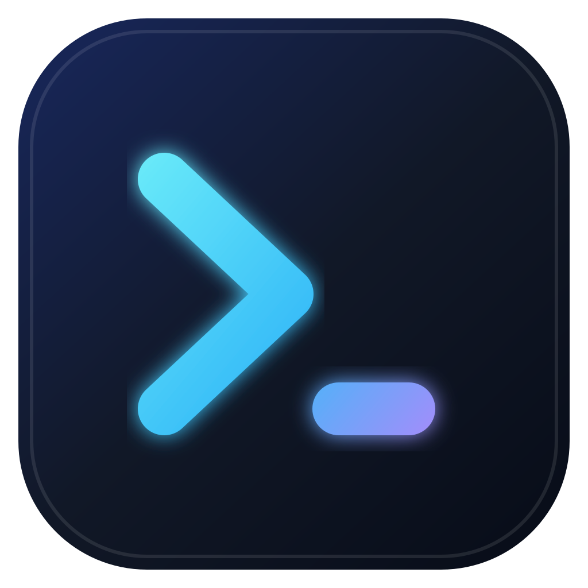

<p align="center"></p>

# DSH Native

[](https://github.com/leonardoxr/dsh-native/actions/workflows/ci.yml)
[](https://github.com/leonardoxr/dsh-native/releases/latest)
[](LICENSE)

A focused native shell for HTTPS web apps—with saved servers, fast reconnects, and a first-class workflow for [DeepSeek Harness](https://github.com/deepseek-ai/deepseek-harness).

DSH Native keeps frequently used web apps out of ordinary browser tabs. The repository includes the cross-platform Electron desktop app and a native SwiftUI companion for iPhone and iPad. Both remember multiple trusted servers and return to the most recently used one at launch.

## Highlights

- **Saved server list** — add, name, remove, edit, and switch between HTTPS endpoints.
- **Unified Workspace Home** — every saved server's workspaces and live sessions in one most-recent-first dashboard, with per-server badges, connection states, cached offline snapshots, and automatic discovery of DSH servers on your Tailscale network.
- **Fast return** — reconnects to the most recently used server on launch and preconnects while the window starts.
- **Focused window** — external links open in the system browser instead of spawning extra app windows.
- **Battery-aware background behavior** — hidden pages use Chromium throttling, dashboard polling pauses off-screen, and the native notification feed remains live in the main process.
- **Native attention alerts** — companion events become deduplicated OS notifications for completed, blocked, failed, question, and approval states.
- **Hardened boundary** — remote pages receive no native host-management capability, and cross-origin navigation opens in the system browser.
- **Native mobile companion** — a polished SwiftUI and WebKit implementation supports iPhone and iPad without Electron or third-party runtime dependencies.

## Download

Prebuilt installers and portable packages are published on the [Releases page](https://github.com/leonardoxr/dsh-native/releases):

| Platform | Release artifacts |
| --- | --- |
| Windows x64 | NSIS installer and portable executable |
| macOS Apple silicon | DMG and ZIP |
| Linux x64 | AppImage and Debian package |

macOS releases target Apple silicon (arm64); Intel Macs are not supported.

> [!IMPORTANT]
> Windows binaries are unsigned. Starting with v0.1.1, macOS apps carry an ad-hoc integrity signature but are not Apple Developer ID signed or notarized. SmartScreen or Gatekeeper may therefore require an explicit first launch. Verify the file against the release's `SHA256SUMS.txt`; see [release documentation](docs/RELEASING.md).

### First launch on macOS

After copying DSH Native into Applications, Control-click the app and choose **Open**. If macOS still reports that the app is damaged, first verify the DMG checksum and then clear quarantine from the copied app:

```sh
xattr -dr com.apple.quarantine "/Applications/DSH Native.app"
```

This workaround is necessary only until releases are Developer ID signed and notarized. Never bypass quarantine for an artifact whose checksum does not match.

### Use DSH Native

1. Launch DSH Native.
2. Choose **Start local DSH Web (port 3080)** to run the existing `dsh` CLI installation, or add a display name and an `https://` URL.
3. Select the server to connect. Launch reconnects to your most recently used server automatically.
4. Open **App → Workspaces…** (<kbd>Ctrl</kbd>/<kbd>Cmd</kbd> + <kbd>H</kbd>) from any connected server to reach the aggregated dashboard.

### Workspace Home

The bundled home screen aggregates workspaces and live sessions from **every saved server plus the managed local instance** into one combined, most-recent-first list. Each card shows the workspace title, path, server name, server URL badge, last-updated time, session count, and that server's connection state (`loading`, `online`, or `unavailable` — including distinct *Not authorized*, *No Companion*, and *Offline (tailnet)* states). One offline server never blocks the rest of the dashboard.

The dashboard paints instantly from each server's last successful snapshot (stored locally in `userData/workspace-cache.json`) and then quietly revalidates on open, on focus, every 60 seconds while visible, and via the explicit **Refresh** action. Cached rows are dimmed and age-labeled until fresh data arrives; stale snapshots are never presented as current, and removing a server deletes its cache.

The **Servers** area at the bottom of the dashboard manages Local, Saved, and discovered machines: start or open the managed local instance, add/rename/remove saved servers, and confirm suggestions under **Found on your Tailnet**. When Tailscale is installed locally, DSH Native lists tailnet peers that answer the Companion endpoint and offers them as one-click additions saved as stable MagicDNS HTTPS URLs (`https://machine.tailnet.ts.net/`). Nothing is saved without confirmation.

The local option runs `dsh web --port 3080`, waits for it to become ready, and stops the process when DSH Native exits. It requires the `dsh` command to be available on `PATH`; port 3080 must be free.

Only HTTPS URLs can be saved. Add servers you trust: connected sites run inside the desktop window and retain normal Chromium site storage in DSH Native's per-user application profile. The server list and performance log are stored locally in Electron's `userData` directory.

## iPhone and iPad companion

The [`ios/`](ios/) project is a native SwiftUI companion for iOS and iPadOS 17 or newer. It includes a saved-host picker, automatic reconnection, persistent WebKit sessions, strict top-level selected-origin navigation, native browser controls, website-data clearing, privacy metadata, and deterministic unit tests.

The iOS source compiles and its simulator suite runs on the project's local Apple-silicon Mac. It is not currently distributed as an installable release: stock iOS requires code signing even for personal-device installation. Use Xcode automatic personal-team signing for your own device, or configure an Apple Developer account before TestFlight/App Store distribution. See [`ios/README.md`](ios/README.md) and the reusable [`scripts/build-ios-remote.ps1`](scripts/build-ios-remote.ps1) helper.

## DeepSeek Harness companion

When the remote app is a DeepSeek Harness web UI, install [dsh-companion](https://github.com/leonardoxr/dsh-companion), an out-of-tree Harness plugin. It exposes lightweight project/session endpoints and a filtered notification event feed. DSH Native connects to those endpoints directly from its main process—remote page content never receives privileged IPC or Companion access. Companion is strictly **read-only**: it lists workspaces, sessions, and events, and cannot create or switch workspaces remotely, so selecting a card in Workspace Home opens the owning server in the normal DSH Web UI rather than navigating to a specific workspace.

The same data feeds the Workspace Home dashboard. Remote servers must present an authority the server trusts: reach them over their MagicDNS name (or any host) and run `dsh web --trusted-host <that-host>` once, otherwise Companion reads return HTTP 403 and the dashboard shows the *Not authorized* state with this hint.

Notifications are shown only while DSH Native is running and its window is not focused. Clicking one restores and focuses the app. Reconnect cursors and stable event keys prevent duplicate alerts during ordinary network interruptions. Choose which turn outcomes, questions, approvals, and subagent events are forwarded in the companion plugin's Harness settings. Closing the app window stops the feed; on Windows and Linux it also exits DSH Native. Keep the window open or minimized to continue receiving alerts.

If a proxy rewrites the `Host` header—for example, Tailscale Serve—add its public authority to the Harness trust fence:

```sh
dsh web --trusted-host your-host.example.net
```

See the [companion installation guide](https://github.com/leonardoxr/dsh-companion#install) for details.

## Develop locally

### Requirements

- Node.js 22.12 or newer
- npm 10 or newer
- A supported Windows, macOS, or Linux desktop
- For iOS work: an Apple-silicon Mac with Xcode 26 and XcodeGen 2.46

```sh
git clone https://github.com/leonardoxr/dsh-native.git
cd dsh-native
npm ci
npm start
```

Run the same checks used by CI:

```sh
npm run check
npm test
```

Create an unpacked app for the current platform with `npm run package`, or distributable installers with `npm run dist`. Outputs are written to `dist/`.

### Project layout

```text
src/
├── main.js                 Electron main process and server management
├── preload.js              Context-isolated bridge for the bundled Workspaces home
├── lib/                    URL policy, local DSH launcher, Companion client and aggregator,
│                            Tailscale status parsing, presentation mapping, SSE feed, notifications
└── renderer/               Bundled Workspace Home dashboard HTML, CSS, and JavaScript
test/                       Node.js unit tests
ios/                        Native SwiftUI iPhone/iPad app and tests
scripts/                    Reusable local and remote build helpers
.github/                    CI, releases, and contribution templates
docs/RELEASING.md           Maintainer release process
```

## Contributing

Contributions are welcome. Read [CONTRIBUTING.md](CONTRIBUTING.md) before opening a pull request, use the issue templates for bugs and ideas, and follow the [Code of Conduct](CODE_OF_CONDUCT.md).

Please report security issues privately as described in [SECURITY.md](SECURITY.md), not in a public issue.

## Roadmap

- Multi-host tabs that keep connected hosts loaded for instant switching.
- Unread badges and per-session notification routing.
- Cold, persisted-only session summaries.
- Signed release binaries and automated update metadata.

## License

[MIT](LICENSE) © 2026 leonardoxr
