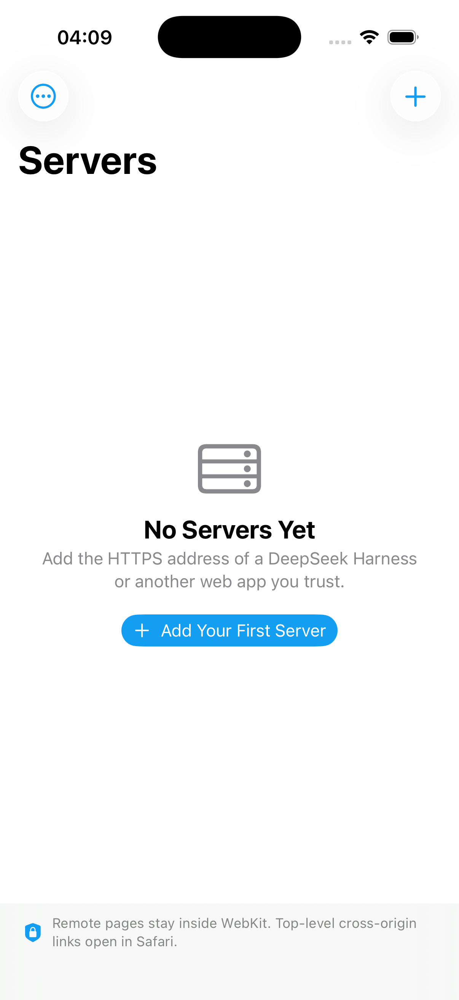
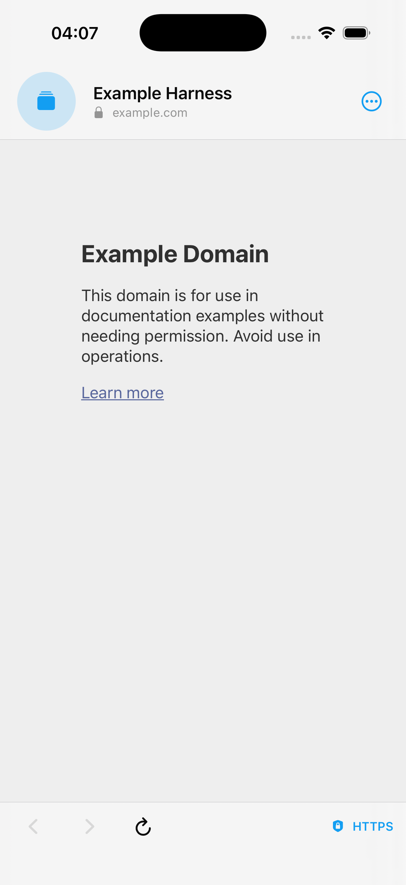

# DSH Native for iOS

The iOS companion is a native SwiftUI application that keeps the desktop shell's core contract: a saved list of trusted HTTPS servers, automatic return to the last server, a focused web view, and an always-visible path back to the server picker.

<p align="center">
  
  
</p>

## Platform support

- iOS and iPadOS 17 or newer
- iPhone and iPad devices (arm64)
- Xcode 26 and Swift 5 language mode
- No third-party runtime dependencies

Stock iOS requires every installed native app to be signed. Simulator builds can be unsigned; installing on a physical device requires automatic personal-team signing, Ad Hoc/TestFlight distribution, or an App Store profile.

## Mobile behavior

- Hosts are stored as an atomically written JSON file under Application Support.
- Only normalized HTTPS URLs without embedded credentials can be saved.
- The selected origin is always visible in trusted native chrome.
- Same-origin main-frame navigation stays in WebKit.
- User-activated, top-level cross-origin HTTPS links open in Safari; automatic cross-origin redirects are blocked. Subresources and frames still follow WebKit's normal web security model.
- TLS uses normal iOS trust evaluation. Self-signed or invalid certificates are never bypassed.
- No JavaScript bridge, injected scripts, analytics, telemetry, or background modes are included.
- Camera and microphone access is denied by default.
- Website cookies and local storage persist through WebKit and can be cleared from the server list.
- The app covers sensitive content in the app switcher when it becomes inactive.

Like every iOS web app, DSH Native may be suspended while backgrounded. It cannot provide the desktop app's unthrottled background execution.

## Build on a Mac

Install the project generator once:

```sh
brew install xcodegen
```

Then generate, test, and compile an unsigned device build:

```sh
cd ios
chmod +x scripts/build.sh
scripts/build.sh
```

The script verifies Apple `swift-format` style, runs unit tests on the latest `iPhone 17 Pro` simulator, and performs a Release compile against the generic iOS device SDK. Override the simulator when needed:

```sh
xcrun simctl list devices available
SIMULATOR_NAME="iPhone 17e" scripts/build.sh
```

## Build over SSH from Windows

The repository includes a PowerShell helper that copies only `ios/` to a temporary directory on the configured Mac and runs the same formatting, test, and compile checks:

```powershell
./scripts/build-ios-remote.ps1 -SshHost losttale-mac
```

The default remote directory is `/tmp/dsh-native-ios-build`. Build products and DerivedData stay outside the repository.

## Open in Xcode

`project.yml` is the source of truth. Regenerate the project after changing files or build settings:

```sh
cd ios
xcodegen generate --spec project.yml
open DSHNative.xcodeproj
```

Select a personal development team under **Signing & Capabilities** to run on your own device. Do not commit signing identities or provisioning profiles.

## Project layout

```text
ios/
├── project.yml                 XcodeGen project definition
├── Branding/                   Source artwork
├── DSHNative/
│   ├── App/                    Lifecycle and root navigation
│   ├── Models/                 Saved-server value types
│   ├── Services/               URL policy and JSON persistence
│   ├── Views/                  Native server and browser UI
│   ├── Web/                    Governed WKWebView session
│   └── Resources/              Info.plist, privacy manifest, assets
├── DSHNativeTests/             Deterministic unit tests
└── scripts/build.sh            Mac build and test entry point
```

## Distribution

A public iOS release cannot be distributed unsigned. Before TestFlight or App Store submission, configure an Apple Developer team, archive with signing enabled, complete privacy metadata, and submit through Apple's normal review process. The current repository deliberately contains no certificate or team identifier.

Because the product intentionally hosts user-selected web applications, App Review may evaluate it under the minimum-functionality rules for web wrappers. The native server manager, origin controls, privacy cover, error recovery, and data controls provide real platform value, but approval cannot be guaranteed. Release notes should explain those native capabilities and provide a working review server.
